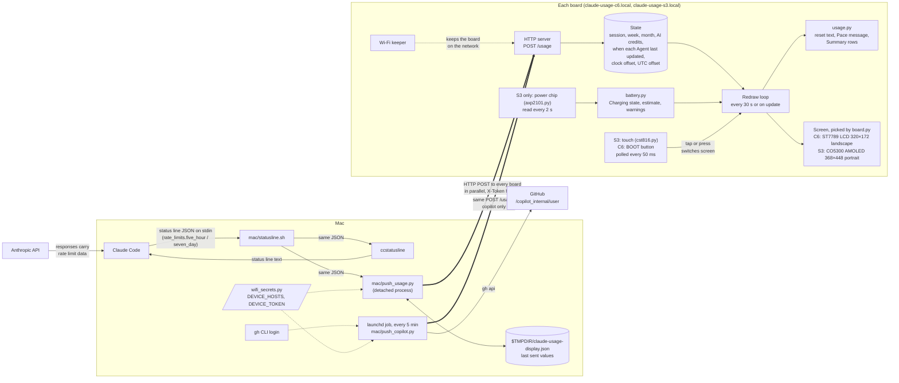
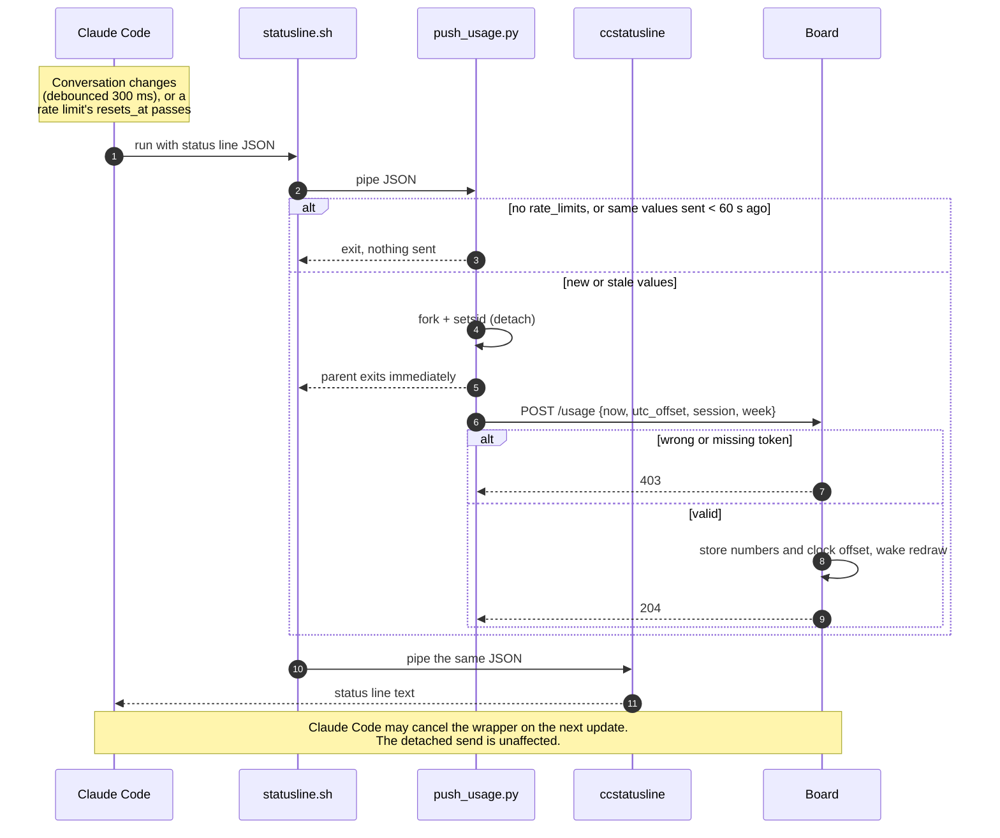
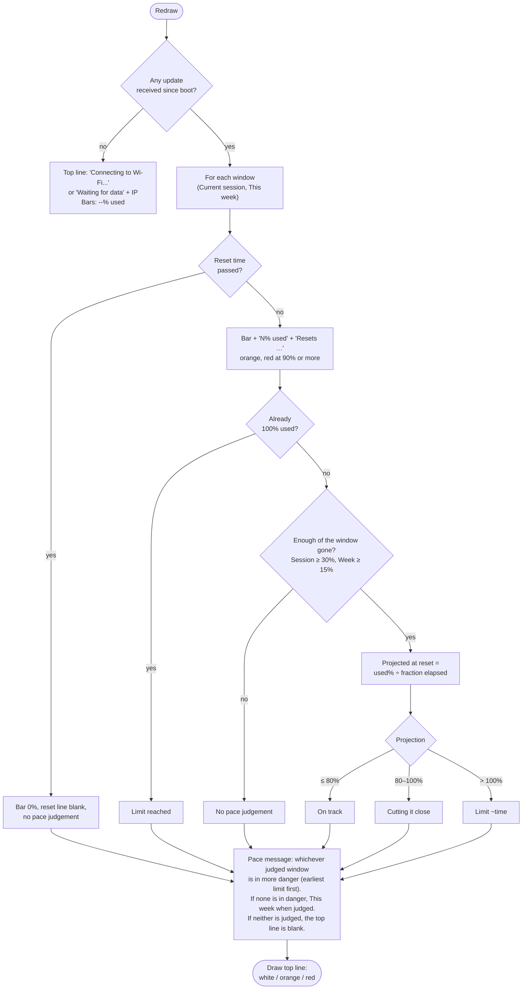

# Architecture

The display shows each **Agent**'s usage (see [CONTEXT.md](../CONTEXT.md)): Claude's **Current session** and **This week**, and Copilot's **This month**. The board never fetches anything; the Mac pushes numbers to it over Wi-Fi. Between updates, the board uses its own clock to keep the screen current.

- **Claude:** Claude Code decides when to send. Each time it runs the status line, the Mac pushes the latest numbers. [ADR 0001](adr/0001-usage-from-status-line-pushed-over-wifi.md) explains why.
- **Copilot:** a launchd job on the Mac fetches This month from GitHub every 5 minutes and pushes it. [ADR 0002](adr/0002-copilot-usage-polled-by-a-mac-background-job.md) explains why this one needs a background job.

## Components

`usage.py` runs on both machines: on the board to draw the screen, and on the Mac for the unit tests.

The same code runs on the Waveshare ESP32-C6-LCD-1.47 and the ESP32-S3-Touch-AMOLED-1.8. At startup `board.py` reads the chip family, sets up that board's display and returns a layout for its screen; the board then announces itself as `<DEVICE_NAME>-c6.local` or `<DEVICE_NAME>-s3.local`. The Mac sends each update to every host in `DEVICE_HOSTS`, so a board that is switched off does not hold up the others.

An update carries Claude's windows, Copilot's This month, or both; the board keeps whatever the update leaves out. To install the Copilot job, run `mac/install_copilot_job.sh`.

## Screens

| Screen | Shows | S3 (touch) | C6 (BOOT button) |
|---|---|---|---|
| **Summary screen** (starts here) | One row per Agent: logo, most pressing Usage bar, short verdict | Tap a row to open that Agent screen; tap the top strip for the Battery screen | Press for the Claude screen |
| **Claude screen** | Pace message, Current session and This week, "Updated N ago" | Tap anywhere for Summary | Press for the Copilot screen |
| **Copilot screen** | Pace message, This month, AI credits used, "Updated N ago" (orange after an hour) | Tap anywhere for Summary | Press for Summary |
| **Battery screen** | Charge level, Charging state, readings in plain words | Tap anywhere for Summary | Not on this board |

Any screen other than the Summary screen goes back to it after 30 seconds without a touch or press. On the S3 the **Battery indicator** sits in the top-right corner of every screen except the Battery screen. `battery.py` turns the power chip's readings into plain words, so like `usage.py` it is unit-tested on the Mac.

## What happens on an update

## What the board draws

The board redraws on each update and every 30 seconds in between, working from the last numbers it received and its own clock.

